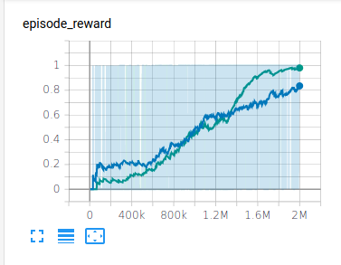
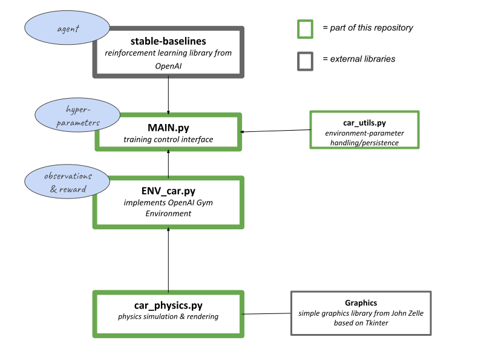

# Self-Learning-Cars-2D
A toy environment for reinforcement learning (a goal-oriented machine learning technique). In the single-agent version, a car is given the task of driving to a randomly assigned target. In the multi-agent version, one car chases and the other car tries to escape.  
In brief, this repository provides two things:  
- a reinforcement learning environment (implementing the common OpenAI Gym standard) (see 1.1 for more information)
- scripts for executing succesful training with PPO (HER + SAC in the works) (see 1.2 for more information)

This is a project I started as a fun excercise to improve my engineering skills in deep reinforcement learning.
The task is not complex, but it's not so easy for the agent to solve the task and success is by no means a default outcome, which makes it an interesting challenge. 
The main goals where to learn how to properly model and implement an environment that in some way represents the world, and to explore the effects on agent behaviour and performance of the following features:
- different reward functions (sparse, shaped, non-linear etc.)
- different observation spaces
- different action spaces  

If you're interested in learning from this project, you could either only download the environment and try for yourself to succesfully train an agent that learns the task, or try to improve the existing solutions, or even try to introduce new elements and challenges to the environment!

#### Updates
##### 2021-02-04
*Up until now, the observed rotation is simply the saved radian value of the physics engine. This can be values above and beyond 2\*pi (or more than 360 degrees), which isn't an issue for the physics engine, but it means that the agent has to recognize that values above 2\*pi actually represent the same rotations that could be oberved below 2\*pi (e.g. that 0 degree and 720 degree correspond to the same rotation). This problem could be solved by returning the rotation modulo 2\*pi as observation, but would introduce the new issue that the agent has to learn that 6.283 and 0 are almost the same rotation, much more similar than, say 0.4 and 0. I think we would want the agent to conceptualize the rotation more like a knob that can be turned and where similar rotations always look similar, so right now I'm experimenting with giving the agent x and y coordinates that represent the rotation on the unit circle (like a knob with radius = 1) and the first results look promising :)*


*Blue is simple radians rotation, green is the new rotation vector. This is just the simple case with a static defender, I expect the results to be even better when the defender is moving and the attacker might have to turn several times.*  

## 1 The Scripts  

  
  
### 1.1 The Gym Environment
The scripts that start with "ENV". They are reinforcement learning environments, which means they are a Markov-decision-process. By implementing the common OpenAI Gym standard, they are compatible with many algorithms, like the RL-library "stable-baselines", which I used in the training scripts.
### 1.2 The Training Scripts
The scripts that start with "MAIN" are the ones that have to be executed in order to start the training process. They set up or load the agents (imported from stable-baselines), initializing the environment, starting and logging the training, saving & loading the trained models and the environment parameters.  
#### 1.2.1 Multi Agent/Attacker and Escaper
In the case of "multi-agent" training, two agents take turns in training, since stable-baselines does not support true multi-agent training (where multiple agents learn from the same episodes). The way I set this up here is by initializing two environments, one for the attacker and one for the escaper. The constructor for the environment gets passed an argument that determines the role of the agent. ```isEscaping=True``` would mean the agent being trained is the escaper. The environment constructor also requires an enemy model, so the agent can actually train against an adversery. It would seem like there might be an infinite regress problem here, because an agent needs an adversery to start training but the adversary needs and adversary to need training and so on - but because an untrained model is a valid model that already has a policy (even though a random one), training can be started without issue.


## 2 Details
### 2.1 Action space
```MultiDiscrete```  
```[a1, a2]```  
  
a1 = [0/1/2] = throttle [no/half/full]  
a2 = [0/1/2] = steer [left/straight/right]  
all action values are integers.

### 2.2 Observation space
```[[x1, y1], [x2, y2], [s2, r2]]```  
  
[x1, y1] = coordinates enemy in 2D euclidian space  
[x2, y2] = coordinates self in 2D euclidian space  
[s2, r2] = self speed, self rotation  
All observed values are floating point numbers.
